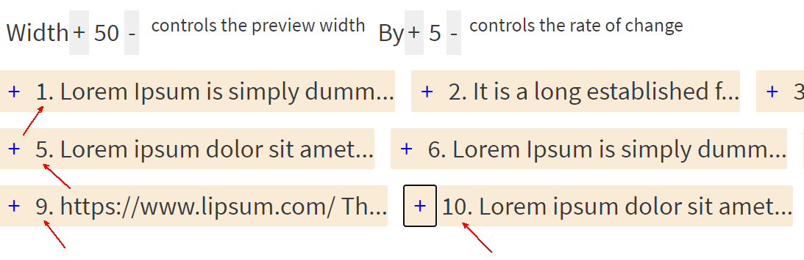

# Optimising Angular

## TODO

- do a test run
- use the angular dev tools to demo check
- consider sharedReplay(1)
- add links to the article and minko's presentation

  - https://medium.com/@guptagaruda/angular-2-4-visualizing-change-detection-default-vs-onpush-3d7ed1f69f8e
  - https://www.mokkapps.de/blog/the-last-guide-for-angular-change-detection-you-will-ever-need/
  - https://www.google.com/url?sa=t&rct=j&q=&esrc=s&source=web&cd=&cad=rja&uact=8&ved=2ahUKEwi5yan2o6PzAhWegv0HHU7zCBoQwqsBegQIBRAB&url=https%3A%2F%2Fwww.youtube.com%2Fwatch%3Fv%3Dl8mCutUMh78&usg=AOvVaw1kCanWwIdtOSmQx4qQlzCy

- have a script and some slides
  - add https://bit.ly/ng-perf-hack21 in the above to enable finding it easy
  - get the people's names and desires or some trivia about themselves (Me - Georgi (joro) about to be a Christmas-time dad while skiing)
  - talk about the app - what is it and why is it
    - we use an actual app to get as close to real-world experience as possible
  - performance on the component level
    - lots of change detect cycles are the worst contributing factor to low performance
  - performance on the module level
  - what is the difference and why address both
  - what to expect
    - a few tasks
    - a review after each task
      - volunteers to share their code and review would take the most out of this

## Setup

- **node 12 required**
- clone
- `npm i` (or `yarn` as you prefer)
- `npm start` (browser -> localhost:4200)

## What influences the app performance?

- On the Component level (low performance). That's usually caused by unnecessary Change Detection cycles or too many of them.
- On the Module level (slow loading)

Page - what the user sees as a page (could be one or more components)

## Low performance (components)

### Performance - trackBy (ngFor)

1. Notice the `/trackby` route of the app accessible via the Task TrackBy on the navigation. Interact with the controls on the left (width, height, by) and notice the updating count of all components. That's because we keep changing the referenced objects filtered and updated by the [`trackby-article.service` (link)](src/app/task-trackby/trackby-article.service.ts#28) with the input provided in the `admin-article-visualize-control.component` (i.e. the aforementioned controls - width, height, by). Every new component instance will prompt Angular to destroy the old instance and replace it with the new in the DOM.

   - the number in front of the component indicates the serial number of the component instance - the first is 1., second 2. and so on
     
   - notice how every time we interact with the width controls that causes a whole set of new components to be instantiated
   - and there is a slow operation to demonstrate a sluggish user experience
   - this might be avoided by using the `trackBy` capability of the `ngFor` directive

2. Add an `articleSlug` property in the `admin-article-list.component`
3. Let it be of type `TrackByFunction<AdminArticle>`
4. Assign a function to the property that accepts index and an item if type `AdminArticle` and return the slug of the article.
5. Now notice the template of `admin-article-list.component`.
6. Add a `;trackBy:articleSlug` to the end of the `*ngFor` declaration. That will instruct Angular to take the returned value and check that for equality with the previous one instead of just comparing object references.
7. Notice how the controls no longer cause the redrawing of the whole list and rather make the existing components change.
8. Review (for help see [component](files/src/app/task-trackby/article-list/articles-list.component.ts.help) and [template](files/src/app/task-trackby/article-list/articles-list.component.html.help))

### Performance - OnPush

1. Notice the `/on-push` route accessible via the Task OnPush on the navigation.

   - notice the number in front of the article preview
   - it counts how many times each component has done its change detection 

2. What is happening?

   - the initial number is caused by router events (see app.component ngOnInit and uncomment router events logging)
   - the first of the component gets twice as many changes because it's getting used for the debugChangeDetection second cycle which gives us the infamous `expressionChangedAfterItHasBeenCheckedError` only in dev mode
     - run `ng serve --prod` to verify that's not the case in a production build where we do not get the debugChangeDetection second cycle
   - each event that triggers change detection triggers change detection for each of the article components, including:
     - typing in the input (each letter counts as an event)
     - interacting with the `[+]`, `[-]` buttons

3. How to fix?

   - using change detections strategy OnPush
   - each article component will only run change detection if its input changes
   - any async pipe input counts too

4. Adjust the change detection strategy of the `admin-article.component` to on-push.
5. Try typing in the input again and notice if the change detection is triggered in the article
6. Review (for help see [task-onpush/article.component.ts.help](files/src/app/task-onpush/article/article.component.ts.help))

### Performance - debounce

1. Notice the `/debounce` route accessible via the Task Debounce nav link.

   - It allows searching of articles.
   - It makes a request for every keystroke of the search input. That might be a slow and costly operation.
   - The number of requests are visualized next to the input field:
     

2. The `debounce-search.component` initializes the search by providing the changes observable to the `debounce-article.service.ts`. Then the service will construct the (mock) request out of each emission of that observable.
3. The effect is manifested by typing in the search resulting in a **request** for **each** typed character
4. Apply the `debounceTime` operator in the `debounce-search.component` (ex `debounceTime(400)`)

   - or in the `debounce-article.service.ts`

5. Notice that the service waits for you to finish writing before sending the request
6. Review (for help see [component](files/src/app/task-debounce/debounce-search.component.ts.help) or [service](files/src/app/task-debounce/debounce-article.service.ts.help))

### Performance - window:mouseout

1. Visit the `/listener` app route.
2. Try interacting with the articles and notice the app "freezes". There is an indicator which spins while the app renders smoothly and stops if the main loop is blocked
3. Use the Angular tools or Browser perf tools to notice where the main thread spends its time

## Slow loading

- long running operations
- multiple data fetching with no data change

### Bundle size

1. Run `npm i -g webpack-bundle-analyzer` see [help](webpack-bundle-analyzer)
2. Run `ng build --prod --stats-json`
3. Run `webpack-bundle-analyzer dist/stats.json` (keep tab open for comparison)
4. Notice

   - article and settings modules are not lazy as opposed to profile, editor, and the task modules
   - all moment locales - even though we need only a few of them - us/ru 

5. Explore what Angular does automatically with the tree shaker
   - Run `ng build ts --prod --common-chunk false --stats-json && webpack-bundle-analyzer dist/ts/stats.json` (notice we are building the [ts project](./projects/ts/src/app/app.component.ts))
   - Checkout the `main`, `secondary` and `third` components and see that **only** the used components end up in the bundles, even though using the shared module and its shared components
6. Demo what Ivy does for us in terms of performance. **Angular 8** requires **node 10** so either use Docker or install Node 10 locally
   - for local build
     - `ng update @angular/cli @angular/core`
     - `ng build ts --prod --common-chunk false --stats-json` (notice we build `ts` app))
     - `webpack-bundle-analyzer dist/ts/stats-es2015.json`
     - navigate to `localhost:8888`
   - for docker demo
     - `docker run -p 8888:8888 gparlakov/demo-ivy`
     - navigate to `localhost:8888`
   - using nvm (node version manger)
     - install nvm ([linux/MacOs](https://github.com/nvm-sh/nvm)) ([windows](https://github.com/coreybutler/nvm-windows))
     - run `nvm install 10.13.0`
     - run `nvm use 10.13.0`
     - run the scripts
       - `ng update @angular/cli @angular/core`
       - `ng build ts --prod --common-chunk false --stats-json` (notice we build `ts` app))
       - `webpack-bundle-analyzer dist/ts/stats-es2015.json`

### Lazy loading

1. Make the Article module lazy
   - remove ArticleModule from AppModule
   - make the route use `loadChildren: "./article/article.module#ArticleModule"`
2. Make Settings module lazy - same steps as above
3. Note the bundle sizes change (run steps 2. and 3. from the Bundle Size section above)
   `ng build --prod --stats-json && webpack-bundle-analyzer dist/stats.json`
4. Review (see [app-routing.module.ts](files/src/app/app-routing.module.ts.help) and [app.module.ts](files/src/app/app.module.ts.help))

### Removal of unused modules manually

1. Check out the moment locales (keep the browser tab open for comparison)
2. Add `"postinstall": "node ./tools/remove-unused-locales.js"` to `scripts` section of package.json
3. Run `npm i` to invoke the post-install hook script
4. `ng build --prod --stats-json` and `webpack-bundle-analyzer ./dist/stats.json` and `` and see the bundle size differ
5. Review

### Manual JS lazy module load

1. Notice the `Pusher` is a large part of our main bundle. Turns out the user needs to agree for us to send them notifications. Let's make the pusher module lazy-loaded - that's a JavaScript module (vs Angular Module - which gets lazy-loaded via Routes primarily though there are [options](https://www.npmjs.com/package/@herodevs/hero-loader))
2. Notice [pusher-service.ts](src/app/core/services/pusher.service.ts). It imports the Pusher library - no matter if anyone uses it or not:
   (i.e. if `I want notifications` has been pressed)
   `ts import * as Pusher from 'pusher-js';`
3. To lazy load that module we need to:

   - change the `module` setting in `tsconfig.app.json` to `esnext`

     ```json
     "module": "esnext"
     ```

   - replace `getPusherInstance` method in pusher service with:

     ```ts
       private getPusherInstance() {
          if (this.instance == null) {
            return Promise.resolve(this.instance);
          }
          return import('pusher-js').then((p: any) => {
             // we know this is imported as { default: PusherStatic } contrary to what our import types this as
             const Pusher: Pusher.PusherStatic = p.default;
             this.instance = new Pusher(this.key, this.config);
           }
           return this.instance;
         });
       }
     ```

4. Now run the `ng build --prod --stats-json && webpack-bundle-analyzer dist/stats.json` and notice now Pusher has its own bundle
5. Review (see [help](files/src/app/core/services/pusher.service.ts.help))
